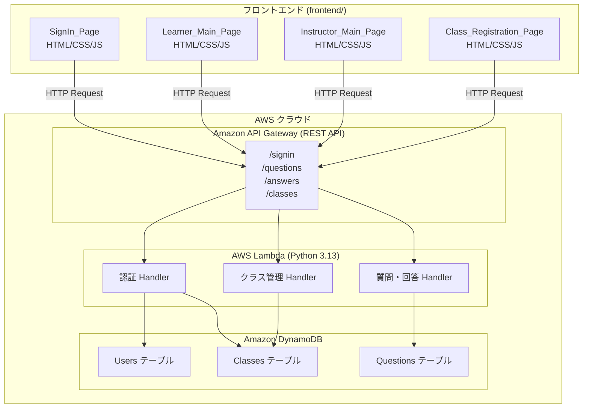
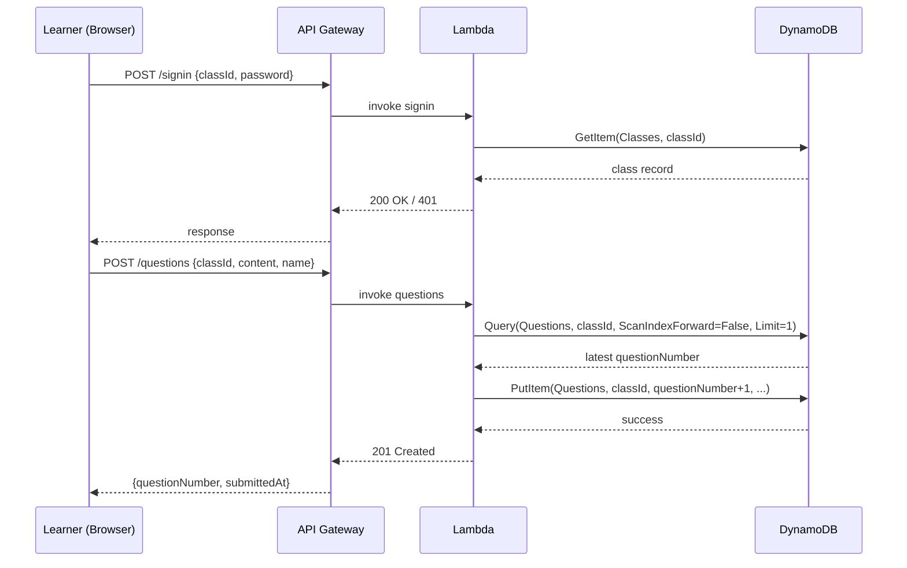

# 設計書: easyQA

## 概要 (Overview)

easyQA は、トレーニングの受講者（Learner）がリアルタイムで質問・コメントを投稿し、インストラクター（Instructor）が回答できるシンプルなWebアプリケーションです。

### アーキテクチャ方針

- **フロントエンド**: Reactなどのフレームワーク不使用の純粋なHTML/CSS/JavaScriptによるSPA
- **バックエンド**: Amazon API Gateway (REST API) + Python 3.13 Lambda 関数
- **データストア**: Amazon DynamoDB (オンデマンドキャパシティモード)
- **デプロイ**: AWS SAM
- **フォルダ構成**: リポジトリルートにて `frontend/` と `backend/` を分離

### 主要ページ構成

| ページ | 対象ユーザー | 概要 |
|--------|-------------|------|
| SignIn_Page | 全ユーザー | ロール選択・認証情報入力 |
| Learner_Main_Page | Learner | 質問送信フォーム + 質問・回答一覧 |
| Instructor_Main_Page | Instructor | 質問・回答一覧 + 回答入力 |
| Class_Registration_Page | Instructor | クラスの登録・編集・一覧 |

### ナビゲーション仕様

| ページ | ヘッダーボタン | 動作 |
|--------|--------------|------|
| SignIn_Page（サインイン前） | なし | — |
| SignIn_Page（アクション選択中） | サインアウト | セッション破棄 → SignIn_Page |
| Learner_Main_Page | サインアウト | セッション破棄 → SignIn_Page |
| Instructor_Main_Page | メニューに戻る / サインアウト | セッション保持で戻る / セッション破棄 |
| Class_Registration_Page | メニューに戻る / サインアウト | セッション保持で戻る / セッション破棄 |

**セッション復元**: インストラクターが SignIn_Page に戻ってきた際、`sessionStorage` にインストラクターセッションが存在する場合はロール選択UIを非表示にし、アクション選択UIを直接表示する。

---

## アーキテクチャ (Architecture)

### システム全体図



### リクエストフロー

1. ブラウザからフロントエンドの静的HTMLを直接開く（またはS3/CloudFrontでホスト）
2. ユーザー操作に応じてフロントエンドがAPI GatewayへHTTPリクエストを送信
3. API GatewayがLambda関数をトリガー
4. Lambda関数がDynamoDBを読み書きしてレスポンスを返す
5. フロントエンドがレスポンスを受けてDOMを更新

### 認証方式

セッション管理はサーバーサイドセッションを使用せず、サインイン成功後にブラウザの `sessionStorage` にClass_IDまたはInstructorIDを保持するシンプルなクライアントサイド管理とします。APIリクエスト時にClass_IDまたはInstructorIDをリクエストボディ・クエリパラメータに含めて認証状態を維持します。

---

## コンポーネントとインターフェース (Components and Interfaces)

### フロントエンドコンポーネント

#### ファイル構成

```
frontend/
├── index.html           # サインインページ
├── learner.html         # 受講者メインページ
├── instructor.html      # インストラクターメインページ
├── class-registration.html  # クラス登録ページ
├── css/
│   └── style.css        # 共通スタイル（クリックフィードバック :active, 折り返し防止 white-space: nowrap を含む）
└── js/
    ├── api.js           # API通信モジュール
    ├── auth.js          # 認証・セッション管理
    ├── signin.js        # サインインページロジック
    ├── learner.js       # 受講者ページロジック
    ├── instructor.js    # インストラクターページロジック
    └── class-registration.js  # クラス登録ページロジック
```

#### api.js モジュール（インターフェース定義）

```javascript
// API基底URLの設定（デプロイ後に更新）
const API_BASE_URL = 'YOUR_API_GATEWAY_URL';

// サインインAPI
async function signIn(role, id, password) { ... }

// 質問一覧取得API
async function getQuestions(classId) { ... }

// 質問送信API
async function submitQuestion(classId, content, name) { ... }

// 回答送信API
async function submitAnswer(classId, questionNumber, answerContent) { ... }

// クラス一覧取得API
async function getClasses(instructorId) { ... }

// クラス登録・更新API
async function saveClass(instructorId, classData) { ... }
```

#### URLリンク変換ユーティリティ

テキスト中のURLを `<a href="..." target="_blank" rel="noopener noreferrer">` に変換する共通関数を `api.js` に実装します。

### バックエンドコンポーネント

#### ファイル構成

```
backend/
├── template.yaml              # SAMテンプレート
├── requirements.txt           # Python依存関係
└── functions/
    ├── signin/
    │   └── app.py             # 認証Lambda
    ├── questions/
    │   └── app.py             # 質問管理Lambda
    ├── answers/
    │   └── app.py             # 回答管理Lambda
    └── classes/
        └── app.py             # クラス管理Lambda
```

### API エンドポイント定義

| メソッド | パス | Lambda | 概要 |
|---------|------|--------|------|
| POST | /signin | signin/app.py | Learner / Instructor 認証 |
| GET | /questions | questions/app.py | 質問・回答一覧取得 |
| POST | /questions | questions/app.py | 質問送信 |
| PUT | /questions/{questionNumber}/answer | answers/app.py | 回答送信 |
| GET | /classes | classes/app.py | クラス一覧取得 |
| POST | /classes | classes/app.py | クラス登録 |
| PUT | /classes/{classId} | classes/app.py | クラス更新 |

#### POST /signin — リクエスト・レスポンス

```json
// リクエスト
{
  "role": "learner" | "instructor",
  "id": "CLASS_ID_or_INSTRUCTOR_ID",
  "password": "password"
}

// 成功レスポンス (200)
{
  "success": true,
  "role": "learner" | "instructor",
  "classId": "CLASS_ID"   // learnerの場合
}

// 失敗レスポンス (401)
{
  "success": false,
  "message": "IDまたはパスワードが正しくありません。"
}
```

#### POST /questions — リクエスト・レスポンス

```json
// リクエスト
{
  "classId": "CLASS_ID",
  "content": "質問内容（最大500文字）",
  "name": "投稿者名（任意・最大50文字）"
}

// 成功レスポンス (201)
{
  "success": true,
  "questionNumber": 42,
  "submittedAt": "2025-01-15T10:30:00+09:00"
}
```

#### PUT /questions/{questionNumber}/answer — リクエスト・レスポンス

```json
// リクエスト
{
  "classId": "CLASS_ID",
  "answer": "回答内容（最大1000文字）"
}

// 成功レスポンス (200)
{
  "success": true
}

// 失敗レスポンス (404)
{
  "success": false,
  "message": "指定された質問が見つかりません。"
}
```

#### POST /classes — リクエスト・レスポンス

```json
// リクエスト
{
  "instructorId": "INSTRUCTOR_ID",
  "classId": "NEW_CLASS_ID",
  "className": "クラス名称（最大100文字）",
  "startDate": "2025-01-01",
  "endDate": "2025-03-31",
  "password": "password"
}

// 成功レスポンス (201)
{
  "success": true
}

// 失敗レスポンス - 重複 (409)
{
  "success": false,
  "message": "同じクラスIDがすでに存在します。"
}
```

---

## データモデル (Data Models)

### DynamoDB テーブル設計

#### 1. Users テーブル

インストラクターアカウントを管理するテーブルです。

| 属性名 | 型 | キー | 説明 |
|--------|-----|------|------|
| `instructorId` | String | Partition Key (PK) | インストラクターID（最大50文字） |
| `passwordHash` | String | — | パスワードのハッシュ値（PBKDF2-SHA256、形式: `pbkdf2:sha256:260000:<salt>:<hex>`） |
| `createdAt` | String | — | 作成日時（ISO 8601） |

> **設計判断**: LearnerはClass単位での認証のため、Usersテーブルは不要。クラスパスワードはClassesテーブルで管理します。

#### 2. Classes テーブル

クラス情報を管理するテーブルです。

| 属性名 | 型 | キー | 説明 |
|--------|-----|------|------|
| `classId` | String | Partition Key (PK) | クラスID（最大50文字） |
| `className` | String | — | クラス名称（最大100文字） |
| `startDate` | String | — | 開始日（YYYY-MM-DD） |
| `endDate` | String | — | 最終日（YYYY-MM-DD） |
| `passwordHash` | String | — | クラスパスワードのハッシュ値（PBKDF2-SHA256、形式: `pbkdf2:sha256:260000:<salt>:<hex>`） |
| `instructorId` | String | — | 所有インストラクターID |
| `createdAt` | String | — | 作成日時（ISO 8601） |

#### 3. Questions テーブル

質問・回答データを管理するテーブルです。

| 属性名 | 型 | キー | 説明 |
|--------|-----|------|------|
| `classId` | String | Partition Key (PK) | クラスID（最大50文字） |
| `questionNumber` | Number | Sort Key (SK) | 質問番号（1以上の整数連番） |
| `content` | String | — | 質問・コメント内容（最大500文字） |
| `name` | String | — | 投稿者名（任意・最大50文字、未入力時は空文字） |
| `submittedAt` | String | — | 提出日時（ISO 8601形式） |
| `answer` | String | — | 回答内容（最大1000文字、未回答時は属性なし） |
| `answeredAt` | String | — | 回答日時（ISO 8601形式、未回答時は属性なし） |

**アクセスパターン**:
- `classId` をPK、`questionNumber` をSKとして、`classId` でクエリし最大100件取得（SKの降順ソートはDynamoDBクエリのScanIndexForwardオプションで実現）
- `classId` + `questionNumber` で個別の質問レコードを取得・更新

**質問番号の連番管理**:  
質問番号は `classId` ごとの連番です。同一クラスへの最新 `questionNumber` を取得（クエリの降順1件）してインクリメントします。競合状態はDynamoDB条件付き書き込みで防止します。

### データフロー図



---

## 正確性プロパティ (Correctness Properties)

*プロパティとは、システムのすべての有効な実行において真であるべき特性または振る舞いのことです。つまり、システムが何をすべきかについての形式的な記述です。プロパティは、人間が読める仕様と機械が検証できる正確性保証の橋渡しをします。*

### Property 1: 質問番号の連番性

*For any* クラスIDに対して、そのクラスにn件の質問が順次送信された場合、各質問に付与された質問番号の集合は {1, 2, ..., n} と等しい（重複・欠番なし・1以上の整数連番）。

**Validates: Requirements 6.7**

### Property 2: 質問一覧の降順ソート

*For any* 2件以上の質問が登録されているクラスに対して、質問一覧取得APIのレスポンスは常に `submittedAt` の降順に並んでいる。

**Validates: Requirements 3.2, 4.2**

### Property 3: テキスト中URLのリンク変換

*For any* URLを1つ以上含むテキスト文字列に対して、URLリンク変換関数を適用した結果は、すべてのURLが `<a href="..." target="_blank" rel="noopener noreferrer">` タグでラップされており、URL以外のテキスト部分は変更されない。

**Validates: Requirements 3.5, 4.3**

### Property 4: 空白文字列の入力拒否

*For any* スペース・タブ・改行などの空白文字のみで構成された文字列を質問内容として入力した場合、バリデーション関数はその入力を無効と判定し、送信処理を中断する。

**Validates: Requirements 2.5**

### Property 5: 文字数超過の入力拒否

*For any* 501文字以上の文字列を質問内容として入力した場合、バリデーション関数はその入力を無効と判定し、送信処理を中断する。

**Validates: Requirements 2.6**

### Property 6: 日付範囲バリデーション

*For any* 開始日と最終日のペア (startDate, endDate) において、startDate > endDate である場合、クラス登録フォームのバリデーションはエラーと判定し、APIへの送信は行われない。

**Validates: Requirements 5.7**

### Property 7: 認証失敗時のHTTP 401返却

*For any* 存在しないIDとパスワードの組み合わせ、または誤ったパスワードによるサインインAPIへのリクエストに対して、バックエンドは常にHTTP 401を返し、成功レスポンスを返すことはない。

**Validates: Requirements 6.6, 1.6, 1.7**

### Property 8: 存在しない質問への回答で404返却

*For any* データベースに存在しない質問番号を指定した回答送信APIリクエストに対して、バックエンドは常にHTTP 404を返す。

**Validates: Requirements 6.9**

---

## パスワードハッシュ方式

bcrypt はC拡張ライブラリのためDocker不使用環境ではLambdaとの互換性問題が発生します。このため、Python標準ライブラリ `hashlib` の PBKDF2-SHA256 を使用します。

### ハッシュ生成（`classes/app.py`）

```python
import hashlib, secrets

def hash_password(password: str) -> str:
    salt = secrets.token_hex(16)
    dk = hashlib.pbkdf2_hmac('sha256', password.encode('utf-8'), salt.encode('utf-8'), 260000)
    return f"pbkdf2:sha256:260000:{salt}:{dk.hex()}"
```

### パスワード照合（`signin/app.py`）

```python
def verify_password(password: str, stored_hash: str) -> bool:
    try:
        _, algorithm, iterations, salt, hash_hex = stored_hash.split(':', 4)
        dk = hashlib.pbkdf2_hmac(algorithm, password.encode('utf-8'), salt.encode('utf-8'), int(iterations))
        return dk.hex() == hash_hex
    except Exception:
        return False
```

### 初期データ登録

インストラクターアカウントの初期登録は AWS CLI で直接 DynamoDB に登録します（詳細は README.md 参照）。

## エラーハンドリング (Error Handling)

### フロントエンドのエラーハンドリング方針

| エラー種別 | 対応 |
|-----------|------|
| 入力バリデーションエラー | 送信前にクライアントサイドで検証し、日本語エラーメッセージをフォーム近くに表示。送信は中断する |
| API通信エラー（ネットワーク障害など） | 日本語エラーメッセージを表示し、入力内容を保持する |
| HTTP 401（認証失敗） | 「IDまたはパスワードが正しくありません。」を表示。SignIn_Pageに留まる |
| HTTP 404（リソース不存在） | 「指定されたリソースが見つかりません。」を表示 |
| HTTP 409（重複） | 「同じクラスIDがすでに存在します。」を表示 |
| HTTP 5xx（サーバーエラー） | 「サーバーエラーが発生しました。しばらく後で再試行してください。」を表示 |

### バックエンドのエラーハンドリング方針

すべてのLambda関数は try/except で全体を囲み、予期しない例外を HTTP 500 として返します。

```python
# 標準エラーレスポンス形式
def error_response(status_code: int, message: str) -> dict:
    return {
        "statusCode": status_code,
        "headers": {
            "Content-Type": "application/json",
            "Access-Control-Allow-Origin": "*"
        },
        "body": json.dumps({"success": False, "message": message}, ensure_ascii=False)
    }
```

### CORS設定

API Gatewayのすべてのエンドポイントに対してCORSヘッダーを設定します。

```yaml
# SAMテンプレートでのCORS設定
Globals:
  Api:
    Cors:
      AllowMethods: "'GET,POST,PUT,OPTIONS'"
      AllowHeaders: "'Content-Type'"
      AllowOrigin: "'*'"
```

---

## テスト戦略 (Testing Strategy)

### テストアプローチ

**二層テスト戦略**:
1. **ユニットテスト**: 具体的な入力例・境界値・エラー条件の検証
2. **プロパティベーステスト**: 任意入力全体にわたる普遍的プロパティの検証

### プロパティベーステスト設定

- **ライブラリ**: Python の [`hypothesis`](https://hypothesis.readthedocs.io/) を使用
- **最小イテレーション数**: 各プロパティテストは最低100回実行
- **外部依存**: DynamoDB呼び出しは `unittest.mock` または `moto` でモック化

```python
# プロパティテストのタグ形式
# Feature: easy-qa, Property {number}: {property_text}
```

### テストケース一覧

#### ユニットテスト（バックエンド）

| テスト対象 | テストケース |
|-----------|-------------|
| サインイン Lambda | 正しい認証情報で200返却 |
| サインイン Lambda | 誤ったパスワードで401返却 |
| サインイン Lambda | 存在しないIDで401返却 |
| 質問送信 Lambda | 正常な質問送信で201返却・questionNumber付与 |
| 回答送信 Lambda | 存在しない質問番号で404返却 |
| クラス登録 Lambda | 重複Class_IDで409返却 |
| クラス登録 Lambda | 正常登録で201返却 |

#### プロパティテスト（バックエンド・フロントエンド）

各プロパティは設計書の「正確性プロパティ」セクションに対応します。

```python
# Feature: easy-qa, Property 1: 質問番号の連番性
@given(st.lists(st.text(min_size=1, max_size=500), min_size=1, max_size=20))
@settings(max_examples=100)
def test_question_numbers_are_sequential(question_contents):
    # n件の質問送信後にquestionNumberが{1...n}と等しいことを検証
    # DynamoDBはmotoでモック化
    ...

# Feature: easy-qa, Property 2: 質問一覧の降順ソート
@given(st.lists(question_strategy(), min_size=2, max_size=20))
@settings(max_examples=100)
def test_question_list_sorted_descending(questions):
    # 一覧取得レスポンスがsubmittedAtの降順になっていることを検証
    ...

# Feature: easy-qa, Property 3: テキスト中URLのリンク変換
@given(text_with_urls_strategy())
@settings(max_examples=100)
def test_url_conversion_wraps_urls_and_preserves_text(text_and_urls):
    # URL変換後にaタグが付与され、URL以外のテキストが保持されることを検証
    ...

# Feature: easy-qa, Property 4: 空白文字列の入力拒否
@given(st.text(alphabet=string.whitespace, min_size=1))
@settings(max_examples=100)
def test_whitespace_only_input_rejected(whitespace_content):
    # 空白のみの入力がバリデーション関数で拒否されることを検証
    ...

# Feature: easy-qa, Property 5: 文字数超過の入力拒否
@given(st.text(min_size=501))
@settings(max_examples=100)
def test_over_limit_input_rejected(long_content):
    # 501文字以上の入力がバリデーション関数で拒否されることを検証
    ...

# Feature: easy-qa, Property 6: 日付範囲バリデーション
@given(date_pair_strategy(start_after_end=True))
@settings(max_examples=100)
def test_invalid_date_range_rejected(start_date, end_date):
    # startDate > endDate のペアがバリデーション関数で拒否されることを検証
    ...

# Feature: easy-qa, Property 7: 認証失敗時のHTTP 401返却
@given(invalid_credentials_strategy())
@settings(max_examples=100)
def test_invalid_credentials_return_401(credentials):
    # 不正な認証情報に対して常に401が返ることをモックで検証
    ...

# Feature: easy-qa, Property 8: 存在しない質問への回答で404返却
@given(st.integers(min_value=1))
@settings(max_examples=100)
def test_answer_to_nonexistent_question_returns_404(question_number):
    # 存在しない質問番号への回答リクエストに対して404が返ることを検証
    ...
```

#### フロントエンドテスト

フロントエンドはフレームワーク不使用のため、以下の方針でテストします。

- **ユニットテスト**: `api.js` の URLリンク変換関数は純粋関数のため Jest でテスト可能
- **統合テスト**: Playwright を使用したE2Eテストで主要フローを検証

#### E2Eテストシナリオ

| シナリオ | 検証内容 |
|---------|---------|
| Learnerサインイン正常フロー | ログイン→メインページ遷移 |
| Learner質問送信フロー | フォーム入力→確認ダイアログ→送信→一覧反映 |
| Instructor回答フロー | ログイン→質問選択→回答入力→送信 |
| クラス登録フロー | クラス情報入力→登録→一覧表示 |
| バリデーションエラー表示 | 空欄送信時のエラーメッセージ確認 |

### インフラテスト

AWS SAM テンプレートは `sam validate` コマンドでスキーマ検証を実施します。デプロイ後の動作確認はE2Eテストで代替します。
