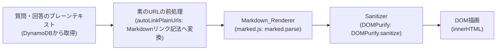
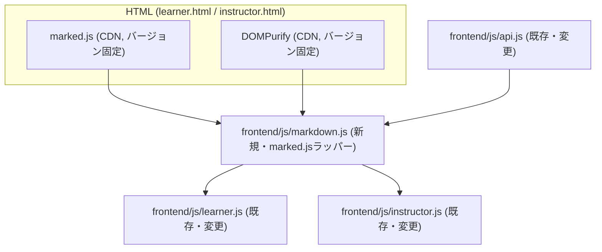

# 設計書

## Overview

本機能は、easyQA の受講者向け画面（Learner_Main_Page）およびインストラクター向け画面（Instructor_Main_Page）における質問内容・回答内容の表示処理を拡張し、改行の反映と、太字・斜体・インラインコード・箇条書きリスト・番号付きリスト・Markdownリンクを少なくとも含み、採用する標準的なMarkdown変換ライブラリが解釈するその他のCommonMark/GFM記法の反映も妨げないMarkdown記法の解釈をクライアントサイドで実現する。

現状の表示処理は `escapeHtml()` によるHTMLエスケープと `convertUrlsToLinks()` によるURL自動リンク化のみで構成されている。本機能ではこの2段構成を、「Markdown変換（Markdown_Renderer、標準的なCommonMark/GFM準拠パーサーである`marked.js`を採用）→ サニタイズ（Sanitizer、`DOMPurify`を採用）」の2段構成に置き換える。バックエンド（`backend/functions/questions/app.py`, `backend/functions/answers/app.py`）およびDynamoDBのデータ保存形式は変更しない。表示のみの変更であるため、既存のAPIリクエスト・レスポンス形式、文字数制限バリデーション（500文字/1000文字、入力文字列に対して適用）はそのまま維持する。

### 対象外・変更しないもの

- Backend Lambda関数（`questions`, `answers`, `classes`, `signin`）のロジック・レスポンス形式
- DynamoDBのテーブル構造・データ保存形式（質問・回答は常にプレーンテキストとして保存）
- 質問・回答の文字数制限バリデーション（変換前の入力文字列に対して適用、変更なし）
- ビルドステップ不要な静的ファイル構成（HTML/CSS/素のJS、フレームワーク不使用）

## Architecture

### 外部ライブラリ選定

補足事項として要件定義書に記載された「標準的なMarkdown変換ライブラリおよびサニタイズライブラリを採用する」という方針に基づき、以下の通り選定する。

**採用するライブラリ:**

| ライブラリ | 役割 | 採用結果 |
|---|---|---|
| `marked.js` | Markdown → HTML変換 | **採用** |
| `DOMPurify` | HTMLサニタイズ | **採用** |

**marked.js を採用とした理由:**

要件2.1は「太字・斜体・インラインコード・箇条書きリスト・番号付きリスト・Markdownリンクを少なくとも含み、採用する標準的なMarkdown変換ライブラリが解釈するその他のCommonMark/GFM記法についても表示への反映を妨げない」と定義されている。つまり本要件は、対象記法を6種類に限定する制約ではなく、「最低限この6種類は解釈できること」を求める最小要件であり、それ以外の記法（見出し・テーブル・コードブロック・引用・水平線等）をライブラリが解釈すること自体は妨げない、というスタンスに変わっている。この時点で、フル機能のCommonMark/GFM準拠パーサーを採用することは要件に矛盾しなくなった。

加えて要件2.3は「サポート対象外の記法または不完全な記法に対する解釈結果は、採用する標準的なMarkdown変換ライブラリの標準的な挙動に従うものとし、当該入力に対する追加のバリデーションを行わない」と定義されている。これにより、従来懸念していた「ライブラリの挙動を要件に合わせて個別に上書き・無効化する必要がある」という問題（`extensions`のオーバーライドや正規表現によるプリプロセス除去の追加実装）が解消された。ライブラリの標準的なパース結果をそのまま受け入れればよいため、フル機能パーサーを採用するコストが大幅に下がっている。

以上を踏まえ、独自の正規表現ベースのパースロジックを自前実装・保守するコストとバグのリスクを避け、実績のある標準的なCommonMark/GFM準拠パーサーである`marked.js`を採用する。`marked.js`は軽量かつ高速な低レベルのMarkdownコンパイラであり、ブラウザ・サーバー双方で動作し、GFM（GitHub Flavored Markdown）の主要な記法（要件2.1の6種類を含む）を標準でサポートする（参考: [marked公式ドキュメント](https://marked.js.org/)）。

**DOMPurify を採用とした理由（維持）:**

要件3（XSS対策とサニタイズ）は、許可要素・属性のホワイトリスト管理、`javascript:`スキーム等の危険なURIスキームの無効化、生HTMLタグのエスケープなど、セキュリティ上ミスが許されない処理を要求している。HTMLサニタイズの自前実装は、エッジケース（属性値内のエンコーディング trick、DOM clobbering、mXSS等）への対応が難しく、実績のあるライブラリを使う方が安全性の面で優れる。`DOMPurify`はXSS対策に特化した実績のあるライブラリであり、許可タグ・属性・URIスキームを設定できるため要件3のホワイトリスト方式にそのまま合致する。`marked.js`公式ドキュメントでも、信頼できない入力を扱う場合の出力HTMLのフィルタリング手段として`DOMPurify`が推奨されている（参考: [marked公式ドキュメント](https://marked.js.org/)）。この方針を変更する理由はないため、DOMPurifyの採用は維持する。

**新規外部依存の明記:**

`marked.js` および `DOMPurify` は、本機能で新たに追加する外部依存である。ビルドステップ不要な静的ファイル構成を維持するため、いずれもCDN（jsdelivr）経由で読み込む。バージョンは固定（ピン留め）し、`latest`等の可変タグは使用しない。

```html
<script src="https://cdn.jsdelivr.net/npm/marked@13.0.3/lib/marked.umd.min.js"
        integrity="sha384-<配布時にjsdelivrが提供するSRIハッシュに置き換える>"
        crossorigin="anonymous"></script>
<script src="https://cdn.jsdelivr.net/npm/dompurify@3.2.4/dist/purify.min.js"
        integrity="sha384-<配布時にjsdelivrが提供するSRIハッシュに置き換える>"
        crossorigin="anonymous"></script>
```

- `marked.js`のバージョン: `13.x`系（2024年末〜2025年時点の安定版を想定。導入時に最新の安定版バージョンへ読み替えて固定する）
- `DOMPurify`のバージョン: `3.2.4`（2024年12月時点の安定版。導入時に最新の安定版バージョンへ読み替えて固定する）
- 配置場所: `frontend/learner.html`, `frontend/instructor.html` の `<script>` 読み込み部分（`js/api.js`より前、`js/markdown.js`より前）。読み込み順序は「`marked.js` → `DOMPurify` → `markdown.js`」とする（順序自体は`markdown.js`側でどちらもグローバル変数として参照するため厳密ではないが、依存元を先に読み込む一貫した順序として定める）
- SRI（Subresource Integrity）: jsdelivrが提供する`integrity`属性をそれぞれに付与し、CDN配信内容の改ざん検知を行う

### 処理フロー全体像



1. APIから取得したプレーンテキスト（`content` / `answer`）を `renderMarkdown(text)` に渡す
2. `renderMarkdown()` は、素のURL（Auto_Link_URL）の一時的なリンク化（後述）を行った上で、`marked.parse(text, options)` を呼び出してMarkdown記法をHTML文字列に変換する。改行の反映は`marked.js`の`breaks`オプションで行う（詳細は次項）
3. 生成されたHTML文字列を `DOMPurify.sanitize(html, SANITIZE_CONFIG)` に渡し、許可要素・属性のみを残したHTML文字列を得る
4. サニタイズ済みHTML文字列を `innerHTML` としてDOMに描画する

この一連の処理を `frontend/js/markdown.js`（新規ファイル）に `renderMarkdownSafe(text)` として実装し、`learner.js` と `instructor.js` の両方から同一関数を呼び出すことで要件2.4（両画面で同一の変換規則を適用）を満たす。`markdown.js`自体はMarkdown記法を自前でパースせず、`marked.js`（CDN経由で読み込んだグローバル`marked`オブジェクト）と`DOMPurify`（同`DOMPurify`オブジェクト）を呼び出す薄いラッパーモジュールとして実装する。

### モジュール構成



- `frontend/js/markdown.js`（新規追加）: `marked.js`によるMarkdown変換、`DOMPurify`によるサニタイズ、素のURL自動リンク化、改行前処理を組み合わせた表示用ラッパーモジュール。Markdown記法自体のパースロジックは持たない
- `frontend/js/api.js`: `convertUrlsToLinks()` を `markdown.js` に統合するため、当該関数を削除して`markdown.js`に移植する
- `frontend/js/learner.js` / `frontend/js/instructor.js`: 質問・回答の描画処理（`renderQuestions()`内）を新しい `renderMarkdownSafe()` 呼び出しに置き換える。`escapeHtml()` はサニタイズをDOMPurifyに一元化するため削除する

## Components and Interfaces

### 1. `frontend/js/markdown.js`（新規ファイル）

表示用のMarkdown変換・サニタイズを担うモジュール。IIFEで実装し、既存コードと同様にグローバル関数として公開する（既存の`api.js`, `auth.js`もグローバル関数方式のため、プロジェクトの既存パターンに合わせる）。Markdown記法自体のパースは行わず、CDNから読み込んだグローバルの`marked`と`DOMPurify`を呼び出すラッパーとして実装する。

#### 公開関数

```javascript
/**
 * 質問・回答の表示用テキストを、改行・Markdown記法を反映した安全なHTML文字列に変換する
 * Markdown_Renderer（marked.js）による変換 → Sanitizer（DOMPurify）による検査の順で適用する
 * @param {string} text - 変換対象のプレーンテキスト（質問内容または回答内容）
 * @returns {string} サニタイズ済みのHTML文字列（innerHTMLに設定して使用する）
 */
function renderMarkdownSafe(text) { /* ... */ }

/**
 * <, >, &, ", ' をエンティティに変換する。投稿者名の表示や、
 * textareaに既存回答をセットする際（Markdown変換を適用しない箇所）に使用する
 * @param {string} text
 * @returns {string} エスケープ済みの文字列
 */
function escapeHtmlEntities(text) { /* ... */ }
```

`learner.js` / `instructor.js` は、これまで `convertUrlsToLinks(escapeHtml(q.content))` としていた箇所を `renderMarkdownSafe(q.content)` に置き換える。

#### 内部関数（`markdown.js` 内、非公開）

| 関数 | 役割 |
|---|---|
| `autoLinkPlainUrls(text)` | Markdownリンク記法（`[text](url)`）で記述されていない素のURL文字列を、`marked.js`に渡す前にMarkdownリンク記法へ変換する（既存 `convertUrlsToLinks` の役割を移植し、変換先をHTML直接生成からMarkdownリンク記法生成に変更する） |
| `renderMarkdown(text)` | `autoLinkPlainUrls()` による素のURLの前処理と、`marked.parse()`（`marked.js`本体）の呼び出しを組み合わせ、サニタイズ前のHTML文字列を生成する |

`markdown.js`が持つロジックは「`marked.js`に渡す前段の素のURLのMarkdownリンク化」「`marked.js`のオプション設定」「`DOMPurify`の設定」の3点のみであり、太字・斜体・箇条書き等のMarkdown記法そのもののパース処理は`marked.js`に委譲する。

#### 変換処理の順序（重要）

XSS対策と記法解釈の順序を誤ると、要件3.2（生HTMLタグの無害化）や要件4.4（二重リンク化の防止）を満たせなくなるため、以下の順序で処理する。

1. **素のURLのMarkdownリンク化（前処理）**（`autoLinkPlainUrls`）: 入力テキストに含まれる、Markdownリンク記法で書かれていない素のURL（`http://`または`https://`で始まる文字列）を検出し、`[URL](URL)`の形のMarkdownリンク記法の文字列に変換する。この前処理により、以降はMarkdownリンク記法1種類だけを考えればよくなり、要件4.4（二重リンク化の防止）の対応が単純化される（詳細は下記「二重リンク化の防止」参照）
2. **`marked.parse()`の呼び出し**: 前処理済みのテキストを`marked.parse(text, MARKED_OPTIONS)`に渡す。`marked.js`が、Markdownリンク（前処理で変換した素のURL分を含む）・太字・斜体・インラインコード・箇条書き・番号付きリスト、および`marked.js`が標準で解釈するその他のCommonMark/GFM記法をHTML要素に変換する。入力テキストに含まれる生HTMLタグ（`<script>`等）は、CommonMarkの仕様に従い`marked.js`がそのまま出力HTMLに含める場合があるが、これは次段のサニタイズで無害化する
3. **改行の反映**（要件1）: `marked.js`の`breaks: true`オプション（`gfm: true`と併用）により、単一の改行を`<br>`として反映する。連続する空行による段落分割は、CommonMarkの標準的な段落解釈（空行区切りで`<p>`要素が分割される）に従う（詳細は次項）
4. **DOMPurifyによるサニタイズ**: `marked.parse()`が生成したHTML文字列を`DOMPurify.sanitize()`に渡す。許可要素・属性のホワイトリスト（後述のSANITIZE_CONFIG）に合致しない要素・属性はすべて除去される。生HTMLタグ（`<script>`等）はここでエスケープ済みの文字列として無害化され、危険なURIスキーム（`javascript:`等）を持つ`href`もDOMPurifyの標準機能により無効化される

#### 二重リンク化の防止（要件4.4）

`marked.js`を採用したことで、二重リンク化の防止は「`marked.js`に渡す前に、素のURLをMarkdownリンク記法に変換しておく」という前処理のみで実現する。具体的には、`autoLinkPlainUrls()`が入力テキスト中の素のURL（`https?://[^\s]+`に相当する文字列）を検出する際、既に`[...](...)`のMarkdownリンク記法の`(...)`部分に含まれるURLは対象から除外する（Markdownリンク記法の正規表現に先にマッチさせ、マッチした範囲を除いた残りの部分だけを素のURL検出の対象とする）。これにより、`marked.parse()`に渡される時点でテキスト中のURLはすべて重複のないMarkdownリンク記法として表現されており、`marked.js`はMarkdownリンクとして1回だけ解釈する。`marked.js`自身が素のURLを自動リンク化する挙動（GFM拡張の一部）に依存しない設計とすることで、ライブラリのバージョンや設定変更による挙動差異のリスクを避ける。

#### 改行の反映仕様（要件1）

`marked.js`のオプションで対応する。

```javascript
const MARKED_OPTIONS = {
  gfm: true,
  breaks: true
};
```

- `breaks: true`（`gfm: true`が前提）: 単一の改行を`<br>`要素に変換する。これはGitHubのコメント表示と同様の挙動であり、要件1.1（改行の位置に対応する改行の表示）を満たす（参考: [marked公式ドキュメント Options](https://marked.js.org/using_advanced)、`breaks`オプションは「単一の改行に`<br>`を追加する（GitHubのコメント表示時の挙動を再現するが、レンダリングされたMarkdownファイルの挙動ではない）。`gfm`が`true`であることが前提」と説明されている）
- 連続する空行（2つ以上の空行）は、CommonMarkの標準的なブロック解釈により新たな段落（`<p>`要素）の区切りとして扱われる。すなわち「入力テキスト中の空行の数」と「表示上生成される`<p>`要素の分割数」が対応し、要件1.2（改行の数に対応する空行の表示反映）を満たす
- 改行処理はMarkdown記法の解釈（リスト化・インライン変換等）と同一の`marked.parse()`呼び出しの中で一括して行われるため、要件1.3（改行の表示処理とMarkdown記法の解釈処理を組み合わせて適用する）を満たす

### 2. Sanitizer設定（DOMPurifyの設定パラメータ）

要件3.1は「Allowed_HTML_Elementsは、採用する標準的なMarkdown変換ライブラリ（`marked.js`）が生成しうるHTML要素（見出し・テーブル・コードブロック・引用・水平線等を含む）のうち、安全性の観点から許可するものに限定する」と定義している。要件2.1により、これらの記法自体の解釈（`marked.js`によるHTML要素への変換）は妨げられないため、サニタイズ段階で個別に許可・除外を判断する。

**設計判断（許可範囲のバランス）**: easyQAの質問・回答表示という用途は、短いプレーンテキストの読みやすさ向上（強調・リスト・リンク等）を主目的としており、要件2.1で「少なくとも」求められている6記法を確実に許可する。見出し・テーブル・コードブロック・引用・水平線についても、`marked.js`が生成するタグ自体は`<script>`のような実行可能な要素ではなく、構造化情報の表示に留まるため、安全性の観点から問題のない範囲で許可し、要件2.1の「その他のCommonMark/GFM記法についても表示への反映を妨げない」という要求を満たす。一方、画像（``）はソース属性（`src`）が外部リソースの読み込みやトラッキングに使われうるため、質問・回答表示という用途では必須ではないと判断し許可しない。生HTMLタグの生ソースそのもの（`marked.js`のオプションで生HTMLパーススルーを無効化する設定と合わせて）や、フォーム関連要素・スクリプト実行系要素も許可しない。

```javascript
const SANITIZE_CONFIG = {
  ALLOWED_TAGS: [
    'p', 'br', 'strong', 'em', 'code', 'pre', 'del',
    'ul', 'ol', 'li',
    'a',
    'h1', 'h2', 'h3', 'h4', 'h5', 'h6',
    'blockquote', 'hr',
    'table', 'thead', 'tbody', 'tr', 'th', 'td'
  ],
  ALLOWED_ATTR: ['href', 'target', 'rel'],
  ALLOWED_URI_REGEXP: /^https?:\/\//i
};

DOMPurify.sanitize(html, SANITIZE_CONFIG);
```

- `ALLOWED_TAGS`:
  - 要件2.1のSupported_Markdown_Syntaxに対応する要素（段落`p`、改行`br`、強調`strong`、斜体`em`、インラインコード`code`、箇条書き`ul`/`li`、番号付きリスト`ol`/`li`、リンク`a`）を許可する
  - `marked.js`がGFM標準で生成するその他の構造化要素のうち、安全性の観点から問題のないもの（コードブロック`pre`、取り消し線`del`、見出し`h1`〜`h6`、引用`blockquote`、水平線`hr`、テーブル`table`/`thead`/`tbody`/`tr`/`th`/`td`）を許可する
  - `img`（画像）、`script`、`iframe`、`style`、`form`、`input`等は`ALLOWED_TAGS`に含めないため、これらのタグが入力（生HTMLタグとして、または`marked.js`の解釈結果として）に含まれていても除去される（要件3.1, 3.2）
- `ALLOWED_ATTR`: リンクに必要な`href`, `target`, `rel`のみを許可する。見出しの`id`属性や`table`の`class`属性等、`marked.js`が付与する可能性のある属性も含め、上記以外の属性はすべて除去される。`onclick`等のイベントハンドラ属性や`style`属性も許可リストに含めないため自動的に除去される（要件3.5）
- `ALLOWED_URI_REGEXP`: `href`属性の値が`http://`または`https://`で始まる場合のみ許可する。`javascript:`スキームなど実行可能なURIスキームを持つリンクは、DOMPurifyによって`href`属性自体が除去され、クリック不可能な通常のテキスト（アンカーなしの状態）として表示される（要件3.3）
- `<script>`, `<iframe>`, ``等は`ALLOWED_TAGS`に含まれないため、生HTMLとして入力された場合はエスケープ済みの文字列として表示される（要件3.2）。`marked.js`の解釈結果として許可外の要素・属性が生成された場合も、`ALLOWED_TAGS`/`ALLOWED_ATTR`によって同様に除去される（要件3.5）

### 3. `frontend/js/api.js`（変更）

- `convertUrlsToLinks()` 関数を削除し、`frontend/js/markdown.js` の `autoLinkPlainUrls()` として移植する。移植にあたり、変換先を「素のURL文字列を直接`<a>`タグのHTML文字列に変換する処理」から「素のURL文字列をMarkdownリンク記法（`[URL](URL)`）の文字列に変換する処理」に変更する（`marked.js`採用に伴う変更。`marked.parse()`に渡す前段の前処理として位置づける）。API通信関数（`signIn`, `getQuestions`, `submitQuestion`, `deleteQuestion`, `submitAnswer`, `getClasses`, `saveClass`）自体は変更しない
- 理由: `api.js`はAPI通信に関する責務のモジュールであり、表示用のURL変換ロジックは`markdown.js`（表示処理モジュール）に集約した方が責務が明確になる

### 4. `frontend/js/learner.js`（変更）

`renderQuestions(questions, classId)` 内の該当箇所を変更する。

**変更前:**
```javascript
const contentHtml = convertUrlsToLinks(escapeHtml(q.content));
// ...
const answerContentHtml = convertUrlsToLinks(escapeHtml(q.answer));
```

**変更後:**
```javascript
const contentHtml = renderMarkdownSafe(q.content);
// ...
const answerContentHtml = renderMarkdownSafe(q.answer);
```

`escapeHtml()` 関数自体は、`renderMarkdownSafe()` 内部（`markdown.js`側）で同等のエスケープ処理を行うため、`learner.js`からは削除する（他の箇所で`escapeHtml`が使われていないことを確認済み: 質問カードの投稿者名`nameDisplay`表示にも使用されているため、この呼び出し箇所は`markdown.js`が公開するエスケープ用ユーティリティ、あるいは`escapeHtml`関数自体を`markdown.js`に移植したうえで`learner.js`からも呼び出せるようにする）。

投稿者名（`name`）はMarkdown解釈の対象外（要件2・3の対象は質問内容・回答内容のみ）のため、単純なHTMLエスケープのみを適用する。`escapeHtmlEntities`を`markdown.js`から公開関数として提供し、`learner.js`・`instructor.js`の投稿者名表示箇所はこれを使用する。

さらに、要件7に対応するMarkdown記法ヒント（`Markdown_Syntax_Hint`）表示のため、`init()`内でのDOM操作は不要（静的HTMLに直接記述するため）。

### 5. `frontend/js/instructor.js`（変更）

`renderQuestions(questions)` 内の該当箇所を変更する。

**変更前:**
```javascript
const contentHtml = convertUrlsToLinks(escapeHtml(q.content));
// ...
if (q.answer) {
  const answerHtml = convertUrlsToLinks(escapeHtml(q.answer));
  // ...
}
// ...
const existingAnswer = q.answer ? escapeHtml(q.answer) : '';
```

**変更後:**
```javascript
const contentHtml = renderMarkdownSafe(q.content);
// ...
if (q.answer) {
  const answerHtml = renderMarkdownSafe(q.answer);
  // ...
}
// ...
// 回答入力欄(textarea)へのセット値は、Markdown変換前のプレーンテキストをエスケープしたものを使用する（要件6.3）
const existingAnswer = q.answer ? escapeHtmlEntities(q.answer) : '';
```

重要な点として、**回答入力欄（`<textarea id="answer-input">`）にセットする既存回答の値は`renderMarkdownSafe()`を適用しない**。`renderMarkdownSafe()`はHTML文字列を生成する関数であり、textareaの初期値（編集対象の生テキスト）にHTML化されたものを設定すると、Markdown記法の記号（`**`等）が失われて再編集ができなくなる（要件6.3）。この既存回答の設定処理は、HTMLタグとして解釈されないtextarea要素の内部テキストであっても、`<`, `>`, `&`のエスケープ（`escapeHtmlEntities`）は継続して適用し、既存の挙動（XSS対策）を維持する。

投稿者名は`instructor.js`のレンダリング処理には現状含まれていないため変更不要。

### 6. `frontend/learner.html`, `frontend/instructor.html`（変更）

- `<head>`または`<body>`末尾のスクリプト読み込み部分に、`marked.js` CDNの`<script>`タグ、`DOMPurify` CDNの`<script>`タグ、`js/markdown.js`の`<script>`タグを追加する。読み込み順序は「marked.js（CDN） → DOMPurify（CDN） → markdown.js → api.js → auth.js → learner.js/instructor.js」とする（`markdown.js`が`marked`および`DOMPurify`のグローバル変数に依存するため、両CDNスクリプトを先に読み込む）
- Markdown記法の入力ガイド（要件7）を、質問入力欄・回答入力欄の近傍に静的HTMLとして追加する（詳細は次項）

### 7. Markdown記法ヒント表示（要件7）

#### 配置場所

- `learner.html`: `<textarea id="question-content">`の直後（`</textarea>`の直後、送信ボタンより前）に配置する
- `instructor.js`側で動的生成される回答フォーム（`<div class="answer-form">`内の`<textarea id="answer-input">`）の直後に、`renderQuestions()`内のHTML生成テンプレート文字列としてヒントを追加する（instructor.htmlは回答フォーム自体が動的にJSで生成されるため、静的HTMLではなくJS側のテンプレートに追加する）

#### マークアップ例（learner.html）

```html
<div class="form-group">
  <label for="question-content">質問・コメント（必須・最大500文字）</label>
  <textarea id="question-content" maxlength="500" rows="4"></textarea>
  <p class="markdown-hint">
    Markdown記法が使えます: <code>**太字**</code> <code>*斜体*</code> <code>`コード`</code>
    <code>- リスト</code> <code>1. 番号付きリスト</code> <code>[リンク](URL)</code>
  </p>
</div>
```

#### マークアップ例（instructor.js内テンプレート、回答フォーム）

```javascript
html += '  <div class="answer-form">';
html += '    <textarea id="answer-input" maxlength="1000" placeholder="回答を入力してください（最大1000文字）">' + existingAnswer + '</textarea>';
html += '    <p class="markdown-hint">Markdown記法が使えます: <code>**太字**</code> <code>*斜体*</code> <code>`コード`</code> <code>- リスト</code> <code>1. 番号付きリスト</code> <code>[リンク](URL)</code></p>';
html += '    <div class="answer-form__actions">';
// ...
```

#### CSS（`frontend/css/style.css`への追加）

`.markdown-hint`クラスを新規追加する。モーダル・アラートを使わず、常時表示される控えめな注記として、既存の`.error-text`等と同系統の小さいフォントサイズ・薄いグレー系の色で実装する（要件7.4）。JavaScriptによる表示・非表示の切り替えは行わず、CSSの`display`は常に有効な状態（`hidden`クラスなどを付与しない）とすることで、入力欄表示中は常に視認可能な状態を維持する（要件7.5）。

```css
/* --------------------------------------------------------------------------
   Markdown記法ヒント（質問・回答入力欄の近傍に常時表示）
   -------------------------------------------------------------------------- */
.markdown-hint {
  margin-top: 6px;
  font-size: 0.75rem;
  color: #9e9e9e;
  line-height: 1.5;
}

.markdown-hint code {
  background-color: #f0f0f0;
  padding: 1px 4px;
  border-radius: 3px;
  font-size: 0.75rem;
  color: #616161;
}
```

### 8. `frontend/index.html`, `frontend/class-registration.html`

これらのページには質問・回答の表示や入力欄が存在しないため、変更不要。

### 9. Backend（変更なし）

`backend/functions/questions/app.py`, `backend/functions/answers/app.py`は、質問内容・回答内容をプレーンテキストとしてそのまま受け取り・保存・返却する現在の実装を変更しない。APIリクエスト・レスポンスのJSON形式、バリデーション（文字数制限等）は本機能の対象外であり、既存のままとする（要件6.4）。

## Data Models

本機能はデータ保存形式を変更しない。DynamoDBの`Questions`テーブルに保存される既存の属性構造をそのまま使用する。

| 属性 | 型 | 説明 | 本機能での扱い |
|---|---|---|---|
| `classId` | String | クラスID（パーティションキー） | 変更なし |
| `questionNumber` | Number | 質問番号（ソートキー） | 変更なし |
| `content` | String | 質問内容（プレーンテキスト、Markdown記法の記号を含む場合がある） | 表示時にのみ`renderMarkdownSafe()`を適用。保存形式は変更なし |
| `name` | String | 投稿者名（任意） | 表示時に`escapeHtmlEntities()`のみ適用（Markdown解釈対象外） |
| `submittedAt` | String (ISO 8601) | 質問送信時刻 | 変更なし |
| `answer` | String (optional) | 回答内容（プレーンテキスト、Markdown記法の記号を含む場合がある） | 表示時（一覧）は`renderMarkdownSafe()`、回答入力欄（textarea）へのセット時は`escapeHtmlEntities()`のみ適用 |
| `answeredAt` | String (ISO 8601, optional) | 回答時刻 | 変更なし |
| `deletePasswordHash` | String | 削除用パスワードのハッシュ | 変更なし |
| `deleted` | Boolean (optional) | 論理削除フラグ | 変更なし |

フロントエンド側で新たに保持する状態は存在しない（`renderMarkdownSafe()`はステートレスな純粋関数として実装する）。

## Correctness Properties

*A property is a characteristic or behavior that should hold true across all valid executions of a system-essentially, a formal statement about what the system should do. Properties serve as the bridge between human-readable specifications and machine-verifiable correctness guarantees.*

`renderMarkdownSafe(text)` および内部の関数（`autoLinkPlainUrls`, `escapeHtmlEntities`）は、テキスト（文字列）を入力とし、HTML文字列を出力する純粋関数であり、入力に応じて出力が明確に変化するロジックである。DOM操作やAPI呼び出しを含まないため、property-based testingに適している。

なお、Markdown記法そのもののパース（太字・斜体・箇条書き等の解釈）は`marked.js`（外部ライブラリ）の責務であり、その内部実装の正しさを検証することは本機能のテスト範囲としない（要件2.3により、対象外・不完全な記法に対する解釈結果は`marked.js`の標準的な挙動に従うことが明示されており、独自の期待値を定義しない）。したがって、太字記法単体の変換や、不完全な記法の扱いについては個別のCorrectness Propertyを設けず、「`marked.js` + `DOMPurify`を組み合わせた`renderMarkdownSafe()`全体としてサニタイズ・リンク処理・改行処理が要件を満たすこと」に絞って性質を定義する。以下、prework分析に基づき性質を定義する。

### Property 1: サニタイズ後は許可要素・属性のみが残る

*For any* テキスト `s`（HTMLタグ・スクリプトを含む任意の文字列、`marked.js`がCommonMark/GFM記法として解釈しうる文字列を含む）について、`renderMarkdownSafe(s)`が返すHTML文字列をDOMにパースした結果、`ALLOWED_TAGS`（`p, br, strong, em, code, pre, del, ul, ol, li, a, h1〜h6, blockquote, hr, table, thead, tbody, tr, th, td`）に含まれないタグ名の要素は存在しない。また、存在する各要素の属性は`ALLOWED_ATTR`（`href, target, rel`）に含まれるものだけである。

**Validates: Requirements 3.1, 3.2, 3.4, 3.5**

### Property 2: 危険なURIスキームは無効化される

*For any* Markdownリンク記法 `[text](url)` の`url`部分が`http://`または`https://`で始まらない文字列（例: `javascript:`, `data:`で始まる文字列）である場合、`renderMarkdownSafe()`の出力には、その`url`を`href`属性値とする`<a>`要素は含まれない。

**Validates: Requirements 3.3**

### Property 3: Markdownリンクと素のURLはそれぞれ1つのリンクに変換される

*For any* 有効なMarkdownリンク記法 `[text](url)`（`url`は`http://`または`https://`で始まる）を含むテキストについて、`renderMarkdownSafe()`の出力に含まれる`<a>`要素の数は、入力に含まれるMarkdownリンクおよび素のURLの合計出現数と一致し、かつ各`<a>`要素は`target="_blank"`と`rel="noopener noreferrer"`を持つ。

**Validates: Requirements 4.1, 4.2, 4.3, 4.4**

### Property 4: 改行が表示に反映される

*For any* テキスト `s1` と `s2`（いずれもMarkdownのブロック記法の記号を先頭に持たない）について、`s1 + "\n" + s2` を変換した出力には、`s1`(エスケープ後)の直後から`s2`(エスケープ後)の直前までの間に改行を表す要素（`<br>`、または段落分割による複数の`<p>`）が少なくとも1つ含まれる。

**Validates: Requirements 1.1, 1.2, 1.3**

### Property 5: Markdown記法が含まれない場合は既存同等の表示になる

*For any* Markdown記法の記号（`**`, `*`, `` ` ``, 行頭の`- `や`\d+\. `, `[...]  (...)`等、`marked.js`がCommonMark/GFM記法として解釈する記号）を一切含まないプレーンテキスト `s` について、`renderMarkdownSafe(s)`の出力からHTMLタグをすべて除去したテキストコンテンツは、`s`に含まれるURLを除く部分と一致する（URLは自動リンク化によりタグに変換されるため、その部分のテキストコンテンツはリンクラベルとして一致する）。

**Validates: Requirements 6.1, 6.2**

## Error Handling

本機能は表示処理のみであり、ネットワークエラーやAPIエラーの扱いは既存実装（`showError()`, `catch`ブロック）を変更しない。表示処理固有のエラーハンドリング方針は以下の通り。

| ケース | 処理方針 |
|---|---|
| `text`が`null`または`undefined`である場合 | `renderMarkdownSafe()`は空文字列`''`を返す（既存の`escapeHtml`/`convertUrlsToLinks`の`if (!text) return '';`と同じ防御的処理を維持する） |
| `DOMPurify`がCDN読み込み失敗等でグローバルに存在しない場合 | `renderMarkdownSafe()`実行時に`DOMPurify is not defined`のような例外が発生する。この場合、質問・回答一覧の描画処理全体が失敗する可能性があるため、`loadQuestions()`側の既存の`try/catch`により「質問一覧の取得に失敗しました。」等のエラーメッセージ表示にフォールバックされる（新規のエラーハンドリング追加は不要、既存の`catch`で捕捉される） |
| Markdown変換処理中に想定外の例外が発生した場合 | `renderMarkdownSafe()`内で`try/catch`を持たせず、呼び出し元（`renderQuestions()`）の例外はそのまま`loadQuestions()`の`catch`に伝播させる。表示処理は複数質問をまとめて`innerHTML`に設定する構造のため、1件の変換失敗が全体の一覧表示に影響しうる点は既存実装と同様のリスクであり、本機能で新たに悪化させない範囲とする |
| DOMPurifyが許可外の要素・属性を除去した結果、閉じタグが欠落する等の不正なHTML構造になった場合 | DOMPurifyはDOM解析ベースで動作するため、内部的に常にwell-formedなHTMLとして出力する（文字列レベルの正規表現除去ではない）。この点はDOMPurify自体の設計保証に依拠する |

ユーザーに表示されるエラーメッセージは、日本語プロジェクトのガイドラインに従いすべて日本語で表示する（既存実装のエラーメッセージ文言を変更しない）。

## Testing Strategy

### Property-Based Testing の適用可否

**テスト対象・対象外の切り分け（`marked.js`採用に伴う変更）**: `marked.js`自体のMarkdownパースロジック（太字・斜体・箇条書き・見出し・テーブル等、CommonMark/GFM記法の解釈）は外部ライブラリの責務であり、そのライブラリ自身のテストスイートによって検証済みのロジックである。本機能では`marked.js`のパース結果そのものを独自にテストの対象とせず、以下の「本機能が実装するロジック」のみをテスト対象とする。

- `markdown.js`内の`autoLinkPlainUrls(text)`, `escapeHtmlEntities(text)`, `renderMarkdown(text)`, `renderMarkdownSafe(text)`（`marked.parse()`と`DOMPurify.sanitize()`の呼び出しと組み合わせ方を含む）
- `marked.js`のオプション設定（`MARKED_OPTIONS`）と`DOMPurify`のサニタイズ設定（`SANITIZE_CONFIG`）が意図した通りに機能すること

これらは、文字列を受け取り文字列を返す純粋関数（または純粋関数と外部ライブラリ呼び出しの組み合わせ）であり、入力パターン（URLの有無・位置、HTMLタグ・スクリプトの混入、改行の有無）によって出力が大きく変わるロジックである。これはPBTが効果を発揮する「データ変換・ビジネスロジック」に該当するため、Correctness Propertiesで定義した5つの性質はいずれもproperty-based testで検証する。

一方、以下はPBTの対象外とし、例示的テスト（unit test）で検証する。

- `marked.js`自体のMarkdown記法パース結果（太字・斜体・箇条書き・見出し・テーブル等の解釈が仕様通りであること）: 外部ライブラリの責務であり、本機能ではテストしない。本機能側では「`marked.js`が生成したHTMLに対してサニタイズ・リンク付与等の後処理が正しく適用されること」のみを検証する
- `learner.html` / `instructor.html`へのCDNスクリプト読み込み（`marked.js`, `DOMPurify`共に）: 静的な設定であり入力変化がないため、動作確認のsmoke testで十分
- `instructor.js`の回答入力欄（textarea）への既存回答セット処理: 「Markdown変換を適用しない」という特定の1つの振る舞いを確認する単体テストで十分（要件6.3）
- DOM操作・イベントバインディング（カードクリック、回答送信ボタン等）: 既存のUIロジックであり本機能による変更が小さいため、必要に応じた単体テストで十分

### テストライブラリ

- テストフレームワーク: **Vitest**（ビルドステップ不要な静的ファイル構成のプロジェクトだが、テスト実行自体はNode.js環境で行うため、軽量なVitestを開発時のみの依存として導入する。本番配信物には影響しない）
- Property-based testingライブラリ: **fast-check**（JavaScript/TypeScript向けの標準的なPBTライブラリ。自前実装しない）
- Markdown変換: テスト環境でも本番と同じ`marked`パッケージ（npm経由でテスト用に開発依存として導入し、CDN版と同一バージョンを指定する）を使用し、`marked.parse()`の呼び出し結果を用いて検証する。`marked.js`自体のパースロジックは検証対象としない
- DOM解析（サニタイズ結果の検証用）: Vitestの`jsdom`環境、またはNode.js上で`DOMPurify`をJSDOM経由で動作させる（DOMPurifyはNode.js環境でも`jsdom`をDOM実装として渡すことで動作可能）

### Property Test 設定方針

- 各Correctness Propertyにつき1つのproperty-based testを実装する
- 各テストは最低100回のランダム入力反復を実行する（fast-checkの`numRuns`オプションで設定）
- 各テストには、対応する設計書のプロパティを参照するコメントタグを付与する
  - タグ形式: `// Feature: markdown-answer-display, Property {番号}: {プロパティ名}`
- テスト対象の文字列生成には、記法の断片（`**`, `*`, `` ` ``, `- `, `[`, `]`, `(`, `)`等）を含む文字列と含まない文字列を組み合わせたカスタムジェネレータをfast-checkの`fc.string()`, `fc.stringOf()`, `fc.oneof()`等で構成する

### Unit Testing方針

- Property testで網羅しきれない具体的な例（要件文書に記載された具体例そのもの: `**太字**`, `- リスト`等が最終的に意図した表示になること）を、少数の代表例として単体テストで確認する。これらは`marked.js`のパースロジック自体の検証ではなく、「`renderMarkdownSafe()`を通した結果、要件2.1の6記法が実際に画面に表示可能な形になっている」という結合的な確認である
- 単体テストは以下に絞る（PBTでカバーされる範囲を重複して数多く書かない、`marked.js`自体のパース網羅テストは書かない）:
  - 太字・斜体・インラインコード・箇条書き・番号付きリスト・Markdownリンクの基本変換例（要件2.1の6記法、各1〜2例、`renderMarkdownSafe()`経由の結合確認）
  - `javascript:`スキームを含むリンクが無効化される具体例（要件3.3）
  - `<script>`タグを含む入力がエスケープ表示される具体例（要件3.2）
  - 回答入力欄（textarea）へのセット値がMarkdown変換前のプレーンテキストである具体例（要件6.3）
  - Markdown記法ヒント（`.markdown-hint`）がDOM上に常時存在すること（`hidden`クラス等が付与されていないこと）の確認（要件7.5）
  - `MARKED_OPTIONS`（`gfm: true`, `breaks: true`）が`marked.js`に正しく渡されていることの確認（設定値のsmoke test）

### テストファイル構成（予定）

```
frontend/js/
  markdown.js              # 実装（新規）
  markdown.test.js         # unit test + property-based test（新規）
```

既存の`api.js`, `learner.js`, `instructor.js`にはテストファイルが存在しないため、本機能ではテスト基盤（Vitest, fast-check）を新規導入する。`package.json`が現状存在しないため、テスト実行用に開発依存のみを含む`package.json`を新規作成する（本番配信物にはNode.js依存を含めない）。
