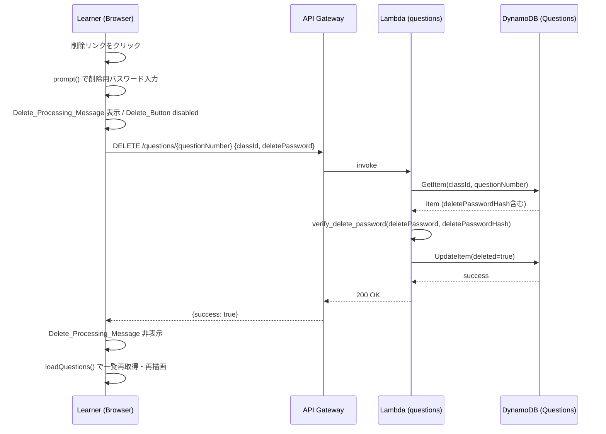

# 設計書: question-delete-and-signin-progress

## 概要 (Overview)

本機能は easyQA アプリケーションに以下の2つを追加する。

**機能1: 質問の論理削除**  
受講者が質問送信時に設定した削除用パスワードを使って、後から自分の質問を論理削除できる機能。DynamoDB のレコードは物理削除せず、`deleted: true` 属性を付与することで削除状態を管理する。削除済み質問は `GET /questions` の結果から除外される。

**機能2: サインイン処理中の表示**  
サインインボタンクリックから結果が返るまでの間、「処理中です」メッセージを表示してボタンを `disabled` にすることで、ユーザーに処理中であることを伝え、二重送信を防ぐ機能。

### 設計方針

- Python 標準ライブラリのみ使用（`hashlib`, `hmac`, `secrets`）
- 既存コードのパターン（`error_response` / `success_response` ヘルパー、PBKDF2-SHA256 形式）を踏襲
- 削除用パスワードのハッシュ検証は `hmac.compare_digest` による定数時間比較
- フロントエンドは既存の `.message` / `.hidden` クラスを活用

---

## アーキテクチャ (Architecture)

### 変更対象コンポーネント

```
変更あり:
  backend/
    template.yaml                ← DELETEイベント追加、CORS追加、UpdateItem権限追加
    functions/questions/app.py   ← DELETEハンドラー追加、GET除外ロジック追加、POST hashlib対応
  frontend/
    index.html                   ← 処理中メッセージ要素追加
    learner.html                 ← 削除処理中メッセージ要素、削除用パスワードフィールド追加
    css/style.css                ← 処理中メッセージ・削除リンクのスタイル追加
    js/api.js                    ← deleteQuestion() 関数追加
    js/signin.js                 ← 処理中表示・disabled制御追加
    js/learner.js                ← 削除リンク生成・削除フロー実装、deletePassword フィールド対応

変更なし:
  backend/functions/signin/app.py
  backend/functions/answers/app.py
  backend/functions/classes/app.py
  frontend/instructor.html
  frontend/js/instructor.js
  frontend/js/class-registration.js
```

### リクエストフロー図（質問削除）



---

## コンポーネントとインターフェース (Components and Interfaces)

### バックエンド: questions/app.py の変更

#### 追加する関数

```python
import hashlib, hmac, secrets

def hash_delete_password(password: str) -> str:
    """削除用パスワードをPBKDF2-SHA256でハッシュ化する"""
    salt = secrets.token_hex(16)
    dk = hashlib.pbkdf2_hmac('sha256', password.encode('utf-8'), salt.encode('utf-8'), 260000)
    return f"pbkdf2:sha256:260000:{salt}:{dk.hex()}"

def verify_delete_password(password: str, stored_hash: str) -> bool:
    """削除用パスワードを定数時間比較で照合する（タイミング攻撃防止）"""
    try:
        _, algorithm, iterations, salt, hash_hex = stored_hash.split(':', 4)
        dk = hashlib.pbkdf2_hmac(algorithm, password.encode('utf-8'), salt.encode('utf-8'), int(iterations))
        return hmac.compare_digest(dk.hex(), hash_hex)
    except Exception:
        return False
```

#### handle_delete_question(event) の追加

```python
def handle_delete_question(event):
    """DELETE /questions/{questionNumber} - 質問の論理削除"""
    # パスパラメータから questionNumber を取得
    path_params = event.get("pathParameters") or {}
    try:
        question_number = int(path_params.get("questionNumber", ""))
    except (ValueError, TypeError):
        return error_response(400, "questionNumber が不正です。")

    # リクエストボディのパース
    try:
        body = json.loads(event.get("body") or "{}")
    except (json.JSONDecodeError, TypeError):
        return error_response(400, "リクエストボディが不正です。")

    class_id = body.get("classId", "").strip()
    delete_password = body.get("deletePassword", "")

    # バリデーション
    if not class_id:
        return error_response(400, "classId は必須です。")
    if not delete_password:
        return error_response(400, "削除用パスワードは必須です。")

    # DynamoDB からレコード取得
    response = table.get_item(Key={"classId": class_id, "questionNumber": question_number})
    item = response.get("Item")

    # 質問が存在しない・または既に削除済みの場合は 404
    if not item or item.get("deleted", False):
        return error_response(404, "質問が見つかりません。")

    # パスワード照合
    stored_hash = item.get("deletePasswordHash", "")
    if not verify_delete_password(delete_password, stored_hash):
        return error_response(401, "削除用パスワードが正しくありません。")

    # 論理削除: deleted = true を設定
    table.update_item(
        Key={"classId": class_id, "questionNumber": question_number},
        UpdateExpression="SET deleted = :val",
        ExpressionAttributeValues={":val": True}
    )

    return success_response(200, {"success": True})
```

#### handle_get_questions の変更

`deleted: true` のアイテムを結果から除外し、`deletePasswordHash` をレスポンスに含めない。

```python
# 変更前
questions.append(question)

# 変更後（deleted フィルタリング追加）
for item in response.get("Items", []):
    # deleted属性がTrueの質問は除外
    if item.get("deleted", False):
        continue
    question = {
        "questionNumber": int(item["questionNumber"]),
        "submittedAt": item["submittedAt"],
        "content": item["content"],
        "name": item.get("name", "")
        # deletePasswordHash は意図的に含めない
    }
    if "answer" in item:
        question["answer"] = item["answer"]
    questions.append(question)
```

#### handle_post_questions の変更

`deletePassword` フィールドを受け取り、バリデーション後にハッシュ化して保存する。

```python
delete_password = body.get("deletePassword", "")

# バリデーション: 半角英数字8文字固定
import re
if not delete_password:
    return error_response(400, "削除用パスワードを入力してください。")
if not re.fullmatch(r'[A-Za-z0-9]{8}', delete_password):
    return error_response(400, "削除用パスワードは半角英数字8文字で入力してください。")

# ハッシュ化して保存
delete_password_hash = hash_delete_password(delete_password)

# PutItem に deletePasswordHash を追加
table.put_item(
    Item={
        "classId": class_id,
        "questionNumber": next_question_number,
        "content": content,
        "name": name,
        "submittedAt": submitted_at,
        "deletePasswordHash": delete_password_hash
        # deletePassword は保存しない
    },
    ...
)
```

#### lambda_handler のルーティング変更

```python
def lambda_handler(event, context):
    http_method = event.get("httpMethod", "")
    path = event.get("path", "")

    if http_method == "GET":
        return handle_get_questions(event)
    elif http_method == "POST":
        return handle_post_questions(event)
    elif http_method == "DELETE":
        # /questions/{questionNumber} へのDELETEリクエスト
        return handle_delete_question(event)
    else:
        return error_response(405, "許可されていないHTTPメソッドです。")
```

---

### フロントエンド: api.js の変更

```javascript
/**
 * 質問削除API
 * @param {string} classId - クラスID
 * @param {number} questionNumber - 削除対象の質問番号
 * @param {string} deletePassword - 削除用パスワード
 * @returns {Promise<object>} 削除結果
 */
async function deleteQuestion(classId, questionNumber, deletePassword) {
  const response = await fetch(`${API_BASE_URL}/questions/${questionNumber}`, {
    method: 'DELETE',
    headers: { 'Content-Type': 'application/json' },
    body: JSON.stringify({ classId, deletePassword })
  });

  if (!response.ok) {
    const errorData = await response.json();
    const error = new Error(errorData.message || '削除に失敗しました。');
    error.status = response.status;
    throw error;
  }

  return response.json();
}
```

### フロントエンド: learner.js の変更

#### renderQuestions における削除リンク追加

```javascript
// 質問カードヘッダーに削除リンクを追加
return `
  <div class="question-card">
    <div class="question-card__header">
      <span class="question-card__number">質問 #${q.questionNumber}</span>
      <span class="question-card__date">${dateStr}</span>
      <span class="question-card__name">${nameDisplay}</span>
      <button class="question-card__delete-link"
              data-question-number="${q.questionNumber}"
              type="button">削除</button>
    </div>
    ...
  </div>
`;
```

レンダリング後にイベントリスナーを登録する（`renderQuestions` の末尾またはDOMへの挿入後）:

```javascript
// 削除リンクのイベントリスナー登録
listContainer.querySelectorAll('.question-card__delete-link').forEach((btn) => {
  btn.addEventListener('click', () => {
    const questionNumber = parseInt(btn.dataset.questionNumber, 10);
    handleDeleteQuestion(classId, questionNumber);
  });
});
```

#### handleDeleteQuestion 関数

```javascript
/**
 * 質問削除処理フロー
 * prompt → 処理中表示 → API呼び出し → 結果反映
 * @param {string} classId - クラスID
 * @param {number} questionNumber - 削除対象の質問番号
 */
async function handleDeleteQuestion(classId, questionNumber) {
  // 削除用パスワード入力
  const deletePassword = prompt('削除用パスワードを入力してください。');
  if (deletePassword === null) {
    // キャンセル: 何もしない
    return;
  }

  // 処理中表示 + 全削除ボタンを無効化
  const processingEl = document.getElementById('delete-processing');
  processingEl.classList.remove('hidden');
  const allDeleteBtns = document.querySelectorAll('.question-card__delete-link');
  allDeleteBtns.forEach((btn) => btn.disabled = true);

  const errorEl = document.getElementById('submit-error');
  errorEl.textContent = '';
  errorEl.classList.remove('message--error');

  try {
    await deleteQuestion(classId, questionNumber, deletePassword);
    // 成功: 一覧再取得・再描画
    await loadQuestions(classId);
  } catch (error) {
    if (error.status === 401) {
      showError(errorEl, '削除用パスワードが正しくありません。');
    } else {
      showError(errorEl, '削除に失敗しました。');
    }
    // 削除ボタンを再度有効化（loadQuestionsで再描画されないため）
    document.querySelectorAll('.question-card__delete-link').forEach((btn) => btn.disabled = false);
  } finally {
    processingEl.classList.add('hidden');
  }
}
```

**注意**: 成功時は `loadQuestions` が呼ばれてDOMが再描画されるため、削除ボタンの `disabled` 解除は不要。失敗時のみ手動で解除する。

#### handleSubmitQuestion の変更（deletePassword フィールド対応）

```javascript
const deletePasswordEl = document.getElementById('question-delete-password');
const deletePassword = deletePasswordEl.value;

// バリデーション: 削除用パスワード（空欄チェック）
if (!deletePassword) {
  showError(errorEl, '削除用パスワードを入力してください。');
  return;
}
// バリデーション: 半角英数字8文字チェック
if (!/^[A-Za-z0-9]{8}$/.test(deletePassword)) {
  showError(errorEl, '削除用パスワードは半角英数字8文字で入力してください。');
  return;
}

// submitQuestion に deletePassword を追加
await submitQuestion(classId, content, name, deletePassword);
```

また `submitQuestion` の呼び出しシグネチャが変わるため `api.js` の `submitQuestion` も変更する:

```javascript
async function submitQuestion(classId, content, name, deletePassword) {
  const response = await fetch(`${API_BASE_URL}/questions`, {
    method: 'POST',
    headers: { 'Content-Type': 'application/json' },
    body: JSON.stringify({ classId, content, name, deletePassword })
  });
  ...
}
```

### フロントエンド: signin.js の変更

#### 処理中表示と disabled 制御

受講者フォームとインストラクターフォームそれぞれの `submit` ハンドラーに以下のパターンを適用する:

```javascript
learnerForm.addEventListener('submit', async (e) => {
  e.preventDefault();
  clearError();

  // --- 追加: 処理中表示 + ボタン disabled ---
  const processingEl = document.getElementById('signin-processing');
  const submitBtn = learnerForm.querySelector('button[type="submit"]');
  processingEl.classList.remove('hidden');
  submitBtn.disabled = true;

  try {
    await signIn('learner', classId, password);
    saveSession('learner', classId, null);
    // 成功時: ページ遷移するためUIの復元は不要
    window.location.href = 'learner.html';
  } catch (error) {
    if (error.status === 401) {
      showError('IDまたはパスワードが正しくありません。');
    } else {
      showError(error.message || 'サインインに失敗しました。');
    }
    // --- 追加: エラー時は処理中表示を解除して再操作可能にする ---
    processingEl.classList.add('hidden');
    submitBtn.disabled = false;
  }
});
```

インストラクターフォームも同じパターンで実装する（`processingEl` と `submitBtn` は `instructorForm` から取得）。

---

## データモデル (Data Models)

### Questions テーブルの変更

既存のスキーマに2属性を追加する。DynamoDB はスキーマレスのため、既存レコードへの影響なし。

| 属性名 | 型 | キー | 追加 | 説明 |
|--------|-----|------|------|------|
| `classId` | String | PK | — | 既存 |
| `questionNumber` | Number | SK | — | 既存 |
| `content` | String | — | — | 既存 |
| `name` | String | — | — | 既存 |
| `submittedAt` | String | — | — | 既存 |
| `answer` | String | — | — | 既存（任意） |
| `answeredAt` | String | — | — | 既存（任意） |
| `deletePasswordHash` | String | — | **追加** | PBKDF2-SHA256ハッシュ値（形式: `pbkdf2:sha256:260000:<salt>:<hex>`） |
| `deleted` | Boolean | — | **追加** | 論理削除フラグ（`true` = 削除済み、属性なし or `false` = 有効） |

**後方互換性**: `deleted` 属性が存在しない既存レコードは `False` として扱うため、既存データに影響なし。`deletePasswordHash` が存在しない既存レコードへの削除リクエストは、`stored_hash` が空文字となり `verify_delete_password` が `False` を返すため HTTP 401 となる（既存質問は削除不可）。

### SAM テンプレートの変更

```yaml
# CORS設定にDELETEを追加
Globals:
  Api:
    Cors:
      AllowMethods: "'GET,POST,PUT,DELETE,OPTIONS'"  # DELETE を追加
      AllowHeaders: "'Content-Type'"
      AllowOrigin: "'*'"

# QuestionsFunction にイベントとIAMポリシーを追加
QuestionsFunction:
  ...
  Policies:
    - Statement:
        - Effect: Allow
          Action:
            - dynamodb:Query
            - dynamodb:PutItem
            - dynamodb:GetItem
            - dynamodb:UpdateItem    # ← 追加（論理削除で UpdateItem を使用）
          Resource:
            - !GetAtt QuestionsTable.Arn
  Events:
    GetQuestions:
      Type: Api
      Properties:
        Path: /questions
        Method: GET
    PostQuestions:
      Type: Api
      Properties:
        Path: /questions
        Method: POST
    DeleteQuestion:                  # ← 追加
      Type: Api
      Properties:
        Path: /questions/{questionNumber}
        Method: DELETE
```

### HTML の変更

#### learner.html の変更

```html
<!-- 質問送信フォームに削除用パスワードフィールドを追加 -->
<div class="form-group">
  <label for="question-delete-password">削除用パスワード（必須・半角英数字8文字）</label>
  <input type="password" id="question-delete-password" maxlength="8">
</div>

<!-- 削除処理中メッセージ要素を追加（初期非表示） -->
<div id="delete-processing" class="message message--processing hidden">処理中です</div>
```

#### index.html の変更

各フォームの送信ボタンの前に処理中メッセージ要素を追加する。受講者フォームとインストラクターフォームは同一の `id` を参照するため、ページ上に1つだけ配置する。

```html
<!-- サインイン処理中メッセージ（フォームの外、2つのフォームから共通参照） -->
<div id="signin-processing" class="message message--processing hidden">処理中です</div>
```

---

## 正確性プロパティ (Correctness Properties)

*プロパティとは、システムのすべての有効な実行において真であるべき特性または振る舞いのことです。つまり、システムが何をすべきかについての形式的な記述です。プロパティは、人間が読める仕様と機械が検証できる正確性保証の橋渡しをします。*

**プロパティ重複チェック（Property Reflection）:**

プレワーク分析の結果から重複を確認する。

- 1.2（空欄バリデーション）と 1.3（形式バリデーション）は異なる検証ロジックのため統合しない。
- 2.2（classId欠損→400）と 2.3（deletePassword欠損→400）はそれぞれ独立したフィールドの検証であるため統合しない。ただし、「必須フィールドの欠損は400を返す」という1つの普遍的プロパティにまとめられる → **統合する（Property 3）**
- 2.4（存在しない質問→404）と 2.8（削除済み→404）は、「DELETEで対象が操作不能な状態なら404を返す」という1つのプロパティにまとめられる → **統合する（Property 4）**
- 2.6（削除成功→deleted=true）と 2.7（物理削除しない）は同一操作の2側面のため統合する → **統合する（Property 5）**
- 1.4（ハッシュラウンドトリップ）と NFR-3（GETレスポンスにhashを含めない）は独立しているため分離する。
- 3.1（deleted除外）と NFR-3（hashを含めない）はどちらもGETレスポンスの形式に関するため統合する → **統合する（Property 7）**
- 6.1（処理中メッセージ表示）と 6.2（ボタンdisabled）は同じトリガー・同じタイミングのため統合する → **統合する（Property 8）**

**最終プロパティ一覧:**

### Property 1: 削除用パスワードの空欄バリデーション

*For any* 空文字列または空白文字のみで構成された文字列を削除用パスワードとして入力した場合、フロントエンドのバリデーション関数はその入力を無効と判定し、送信処理を中断する。

**Validates: Requirements 1.2**

### Property 2: 削除用パスワードの形式バリデーション

*For any* 半角英数字8文字（`[A-Za-z0-9]{8}`）以外の文字列（7文字以下、9文字以上、記号含む、全角文字含む）を削除用パスワードとして入力した場合、バリデーション関数はその入力を無効と判定する。

**Validates: Requirements 1.3**

### Property 3: 必須フィールド欠損時の 400 返却

*For any* `DELETE /questions/{questionNumber}` リクエストのボディに `classId` または `deletePassword` のいずれかが欠損している場合、API は常に HTTP 400 を返す。

**Validates: Requirements 2.2, 2.3**

### Property 4: 操作不能な質問への DELETE で 404 返却

*For any* `DELETE /questions/{questionNumber}` リクエストに対して、対象レコードが存在しない場合、または `deleted: true` が設定済みの場合、API は常に HTTP 404 を返す。

**Validates: Requirements 2.4, 2.8**

### Property 5: 論理削除の永続性と物理削除の禁止

*For any* 有効な `(classId, questionNumber, deletePassword)` の組み合わせに対して DELETE を実行した後、DynamoDB のレコードを `GetItem` で取得すると、レコードが存在し続け、かつ `deleted` 属性が `true` に設定されている。

**Validates: Requirements 2.6, 2.7**

### Property 6: 削除用パスワードのハッシュラウンドトリップ

*For any* 有効なパスワード文字列（半角英数字8文字）に対して `hash_delete_password` でハッシュ化した後、`verify_delete_password` で照合すると `True` を返す。また、1文字でも異なるパスワードで照合した場合は `False` を返す。

**Validates: Requirements 1.4, NFR-1, NFR-4（hmac.compare_digestによる定数時間比較の正確性）**

### Property 7: GET レスポンスの安全なフィルタリング

*For any* `deleted: true` のアイテムと `deleted: false` または `deleted` 属性なしのアイテムが混在する質問リストに対して、`GET /questions` のレスポンスには `deleted: true` のアイテムが含まれず、かつどのアイテムにも `deletePasswordHash` が含まれない。

**Validates: Requirements 3.1, 3.2, NFR-3**

### Property 8: サインイン処理中の UI 状態制御

*For any* 有効なフォーム入力（classId または instructorId と password が入力済み）でサインインボタンをクリックした直後（API レスポンス到着前）に、`signin-processing` 要素が表示状態であり、かつサインインボタンが `disabled` 状態である。

**Validates: Requirements 6.1, 6.2**

---

## エラーハンドリング (Error Handling)

### バックエンドのエラーレスポンス一覧（新規追加分）

| エンドポイント | 条件 | ステータス | メッセージ |
|--------------|------|-----------|----------|
| POST /questions | `deletePassword` が空欄 | 400 | 「削除用パスワードを入力してください。」 |
| POST /questions | `deletePassword` が半角英数字8文字以外 | 400 | 「削除用パスワードは半角英数字8文字で入力してください。」 |
| DELETE /questions/{n} | `classId` が欠損 | 400 | 「classId は必須です。」 |
| DELETE /questions/{n} | `deletePassword` が欠損 | 400 | 「削除用パスワードは必須です。」 |
| DELETE /questions/{n} | 質問が存在しない / 既に削除済み | 404 | 「質問が見つかりません。」 |
| DELETE /questions/{n} | パスワード不一致 | 401 | 「削除用パスワードが正しくありません。」 |
| DELETE /questions/{n} | 削除成功 | 200 | `{"success": true}` |

### フロントエンドのエラーハンドリング方針

| エラー種別 | 対応 |
|-----------|------|
| 削除用パスワード 空欄 | 「削除用パスワードを入力してください。」を `#submit-error` に表示して送信中断 |
| 削除用パスワード 形式不正 | 「削除用パスワードは半角英数字8文字で入力してください。」を表示して送信中断 |
| DELETE API 401 | 「削除用パスワードが正しくありません。」を `#submit-error` に表示。処理中表示を解除・ボタン再有効化 |
| DELETE API その他エラー | 「削除に失敗しました。」を表示。処理中表示を解除・ボタン再有効化 |
| prompt() キャンセル | 削除処理を行わず通常状態に戻る（`null` チェック） |
| サインイン 401 | 既存と同じ「IDまたはパスワードが正しくありません。」を表示。**加えて** 処理中表示解除・ボタン再有効化 |
| サインイン その他エラー | 既存と同じメッセージ。**加えて** 処理中表示解除・ボタン再有効化 |

### finally ブロックの利用方針

`handleDeleteQuestion` と `signin.js` の各フォームハンドラーでは `try/catch/finally` パターンを使う。ただし **成功時はページ遷移または DOM 再描画** が発生するため、`finally` での処理中表示の非表示化は副作用を引き起こさない範囲に限定する。

具体的には:
- 削除成功時: `loadQuestions` 内で DOM が再描画されるので、`finally` で `delete-processing` を非表示化しても問題なし
- サインイン成功時: `window.location.href` によるページ遷移前にUIの状態を戻す必要はないが、`finally` での処理は遷移前に実行されるため、処理中メッセージが一瞬消えることがある。これは許容範囲とする

---

## テスト戦略 (Testing Strategy)

### テストアプローチ

**二層テスト戦略:**
1. **ユニットテスト**: 具体的な入力例・境界値・エラー条件の検証
2. **プロパティベーステスト**: 普遍的プロパティを任意入力で検証

### プロパティベーステスト設定

- **ライブラリ**: Python の [`hypothesis`](https://hypothesis.readthedocs.io/)
- **最小イテレーション数**: 各プロパティテストは最低 100 回実行
- **外部依存**: DynamoDB 呼び出しは `unittest.mock` または `moto` でモック化
- **タグ形式**: `Feature: question-delete-and-signin-progress, Property {number}: {property_text}`

### プロパティテスト実装方針

```python
from hypothesis import given, settings
from hypothesis import strategies as st
import re

# 有効なdeletePasswordを生成するストラテジー
valid_delete_password = st.text(
    alphabet=st.characters(whitelist_categories=('Lu', 'Ll', 'Nd')),
    min_size=8, max_size=8
).filter(lambda s: re.fullmatch(r'[A-Za-z0-9]{8}', s) is not None)

# 無効なdeletePasswordを生成するストラテジー（長さ違い・記号含む・全角含む）
invalid_delete_password = st.one_of(
    st.text(min_size=1, max_size=7),           # 短すぎる
    st.text(min_size=9),                        # 長すぎる
    st.text(min_size=8, max_size=8).filter(    # 記号や全角を含む8文字
        lambda s: not re.fullmatch(r'[A-Za-z0-9]{8}', s)
    )
)

# Feature: question-delete-and-signin-progress, Property 1: 削除用パスワードの空欄バリデーション
@given(st.text(alphabet=st.characters(whitelist_categories=('Zs',)), min_size=0, max_size=20))
@settings(max_examples=100)
def test_empty_delete_password_rejected(whitespace_str):
    assert validate_delete_password(whitespace_str) is False

# Feature: question-delete-and-signin-progress, Property 2: 削除用パスワードの形式バリデーション
@given(invalid_delete_password)
@settings(max_examples=100)
def test_invalid_format_delete_password_rejected(password):
    assert validate_delete_password(password) is False

# Feature: question-delete-and-signin-progress, Property 6: 削除用パスワードのハッシュラウンドトリップ
@given(valid_delete_password)
@settings(max_examples=100)
def test_hash_round_trip(password):
    hashed = hash_delete_password(password)
    assert verify_delete_password(password, hashed) is True
    # 1文字変えたパスワードで照合すると False
    wrong = password[:-1] + ('X' if password[-1] != 'X' else 'Y')
    assert verify_delete_password(wrong, hashed) is False
```

### ユニットテスト一覧

| テスト対象 | テストケース |
|-----------|-------------|
| `handle_delete_question` | classId欠損で400返却 |
| `handle_delete_question` | deletePassword欠損で400返却 |
| `handle_delete_question` | 存在しない質問で404返却 |
| `handle_delete_question` | deleted=trueの質問で404返却 |
| `handle_delete_question` | パスワード不一致で401返却 |
| `handle_delete_question` | 正常削除でdeleted=trueが設定されレコードが残存 |
| `handle_get_questions` | deleted=trueの質問が結果に含まれない |
| `handle_get_questions` | deleted属性なしの質問が結果に含まれる |
| `handle_get_questions` | レスポンスにdeletePasswordHashが含まれない |
| `handle_post_questions` | deletePassword空欄で400返却 |
| `handle_post_questions` | deletePassword形式不正で400返却 |
| `handle_post_questions` | 正常送信でdeletePasswordHashが保存される |
| `hash_delete_password` | 生成されたハッシュが `pbkdf2:sha256:260000:` で始まる |
| `verify_delete_password` | 正しいパスワードでTrueを返す |
| `verify_delete_password` | 誤ったパスワードでFalseを返す |
| `verify_delete_password` | 不正なhash形式でFalse（例外なし）を返す |
| `deleteQuestion` (JS) | 正常削除でHTTP DELETEリクエストを送信 |
| `handleDeleteQuestion` (JS) | prompt()キャンセル時にAPIを呼ばない |
| `handleDeleteQuestion` (JS) | 401時にエラーメッセージを表示 |
| signin処理中表示 | クリック直後にprocessing表示・ボタンdisabled |
| signin処理中表示 | 失敗時にprocessing非表示・ボタン再有効化 |
